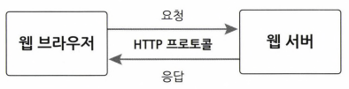
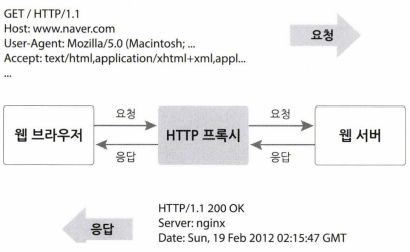
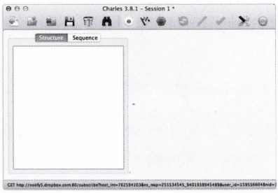
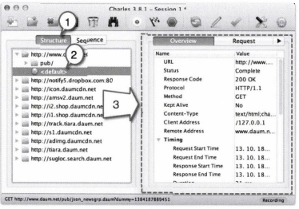
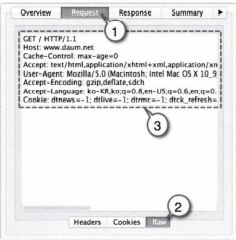
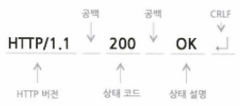

# 제2장 : 웹 프로그래밍 기초 다지기[↩](../../)

## contents📑

* 1_ HTTP 프로토콜의 이해 [👉](#1_)
  * 1_1 HTTP 모니터링[✏](#1_1)
  * 1_2 HTTP 프록시 실행[✏](#1_2)
  * 1_3 HTTP 요청[✏](#1_3)
  * 1_4 HTTP 응답[✏](#1_4)
  * 1_5 HTTP 클라이언트만들기[✏](#1_5)
  * 1_6 콘솔창의 출력 크기를 늘리거나 제한을 없애기[✏](#1_6)
* 2_ GET 요청
  * 2_1 웹 애플리케이션 프로젝트 생성, 배치, 실행
  * 2_2 GET 요청 1 - 웹 브라우저 주소창에 URL을 입력하는 경우
  * 2_3 GET 요청 2 — 링크를 클릭하는 경우
  * 2_4 GET 요청 3 — 입력 폼의 method 속성값이 get인 경우
  * 2_5 GET 요청의데이터 전달 형식
  * 2_6 GET 요청의쓰임새
  * 2_7 문제점과개선방안
* 3_ POST 요청
  * 3_1 POST 요청의 장점 - 입력값을 URLOII 노출하지 않는다.
  * 3_2 POST 요청의 HTTP 프로토콜 확인
  * 3_3 POST 요청의 단점 - 요청 결과를 공유할 수 없다.
  * 3_4 문제점과개선방안
* 4_ 파일 업로드✔
  * 4_1 파일 업로드를 위한  태그 설정
  * 4_2 멀티파트 방식의 POST 요청 프로토콜 분석
* 2.5 정리

## 1_ HTTP 프로토콜의 이해[📑](#contents)

 웹 애플리케이션은 웹을 기반으로 구동되기 때문에 웹 프로그래밍을 하려면 웹 브라우저와 웹 서버 간의 통신 프로토콜을 이해하는 것이 필수입니다. 이 프로토콜을 HTTP(Hyper-Text Transfer Protocol)이라고 부릅니다. 이번 장 에서는 HTTP 문법에 따라 웹 브라우저가 웹 서버에게 서비스를 요청하고 웹 서버가 응답하는 방법을 살펴보겠습니다.
 * HTTP 프로토콜 : 웹 브라우저와 웹 서버 사이의 데이터 통신 규칙

> **그림2-1** 웹 브라우저와 웹 서버 간의 통신 프로토콜 HTTP

* HTTP 프로토콜은 단순히 HTML 페이지나 이미지 파일을 전송하는 차원을 넘어서 원격 컴퓨터 에 로딩되어 있는 함수나 객체의 메서드를 호출할 때도 사용됨.

* 클라이언트와 서버 사이에 서비스를 요청하고 응답을 하는 방식

  * SOAP(Simple Object Access Protocol)
  * RESTful(REpresentational State Transfer) : AWS 클라우드, KT의 클라우드에서 제공하는 API

* HTTP 프로토콜 응용 기술

  * WebDAV(World Wide Web Distributed Authoring and Versioning)

    : 웹 상에서 여러 사람이 문서나 파일을 더 쉽게 편집하고 다룰 수 있게 협업을 도와주는 기술

  * CalDAV

    : 캘린더 데이터를 보다 쉽게 편집하고 공유할 수 있도록 WebDAV를 확장한 기술

### 1_1 HTTP 모니터링[📑](#contents)

HTTP 프록시 프로그램 : 웹 브라우저와 웹 서버 사이에 주고받는 데이터들의 이동 경로

> **그림2-2** 프록시 프로그램의 요청 • 응답 데이터 가로채기
>
> 1. 웹 브라우저가 웹 서버에게 요청을 하면 HTTP 프록시가 그 요청을 대신 받아서 서버에 전달합니다. 
> 2. 서버에서 응답이 오면 HTTP 프록시가 그 응답을 대신 받아서 웹 브라우저에게 전달합니다. 

 이렇게 웹 브라우저와 웹 서버의 중간에서 요청이나 응답 내용을 중계해 주기 때문에 둘 사이에 서 주고받는 내용이 무엇인지 엿볼 수 있습니다.

>  **프록시 서버(Proxy Server)**는 클라이언트와 서버 사이에서 통신을 중계해 주는 컴퓨터 나 프로그램을 말합니다. 
>
> 1. **프록시 서버의 주된 용도 중 하나** : 빠른 전송
>
>     빠른 전송을 위하여 서버의 응답 결과를 캐시에 저장해 두는 것입니다. 예를 들어 클라이언트가 요청한 것이 캐시(cache; 외부 서버로부터 받은 데이터를 임시 보관해두는 장소)에 있을 경우 외부 서버에 요청을 전달 하지 않고 즉시 캐시에 저장된 내용을 전달하기 때문에 클라이언트는 빠른 응답 결과를 받게 됩니다. 
>
> 2. **프록시 서버를 두는 두 번째 이유** : 보안
>
>     첨단 기술을 다루는 회사의 경우 내부 사용자의 기밀 유출에 민감할 수밖에 없습 니다. 이런 경우 프록시 서버를 이용하면 외부 로 전달되는 데이터를 검사하여 특정 단어가 포 함된 자료의 송 • 수신을 차단하거나 보안 팀에 경고 메시지를 보낼 수 있습니다.

### 1_2 HTTP 프록시 실행[📑](#contents)

* HTTP모니터링 프로그램 : Charles, Fiddler

#### HTTP 모니터링 프로그램 실습 : Charles

#### 1. ‘Charles' 프로그램 실행
: 설치 후 윈도우 시작메뉴에서 [모든 프로그램] - [Charles] - [Charles] 메뉴를 클릭

> **그림2-3**  Charles 실행

#### 2.  '다음(www.daum.net)' 사이트 실행

#### 3.  Charles 프로그램의 화면을 통해 웹 브라우저가 요청한 내용 출력

> **그림2-5**  www.daum.net 사이트의 요청 목록
>
> HTTP 프로토콜의 상세 내용을 확인하려면 다음 안내에 따라 확인합니다.
>
> 1. [Structure] 탭을 클릭합니다. 사이트 별로 요청 내용을 묶어서 출력됩니다.
> 2. ’다음' 사이트의 메인 화면에 대한 요청 - 응답 프로토콜을 확인하기 위해 요청 목록에서 [default] 항목을 클릭합니다.

* 여기서 window 환경에서는 [default] 부분이 나오니 않는다...[unknown]인가..?

### 1_3 HTTP 요청[📑](#contents)

#### 4. 웹 브라우저가 웹 서버에게 요청하는 형식 파악

> **그림 2-6** www.daum.net의 HTTP 요청 정보
>
> 다음 절차에 따라 진행하세요.
>
> 1. 화면 오른쪽에 [Request] 탭을 클릭합니다. 
> 2. 출력된 창 아래의 [Raw] 탭을 클릭합니다. 가공하지 않은 원래 요청 데이터를 출력할 것입니다. 
> 3. 앞의 그림은 HTTP 요청 내용을 출력한 결과 화면입니다.

#### <u>서버에게 보낸 HTTP 요청 내용</u>

: www.daum.net의 HTTP 요청 정보의 일부

---
* 01 GET / HTTP/1.1 [👉](#req-line)
* 02 Host: www.daum.net
* 03 Cache-Control: max-age=0
* 04 Accept:text/html,application/xhtml+xml,application/xml;q=0.9,image/webp,*/*;q=0.8
* 05 User-Agent: Mozilla/5.0 (Macintosh; Intel Mac OS X 10_9_0) AppleWebKit/537.36(KHTML, like Gecko) Chrome/30.0.1599.101 Safari/537.36[👉](#req-header)
* 06 Accept-Encoding: gzip, deflate, sdch
* 07 Accept-Language: ko-KR,ko;q=0.8,en-US;q=0.6,en;q=0.4
* 08[👉](#req-data)

---

>  **개행 문자**란 문자열 한 줄이 끝나고 새로 운 줄을 시작한다는 것을 의미하는 문자입니다. MS 윈도우에서는 CR(Carriage Return) 코드와 LF(Linefeed) 코드를 함께 사용하여 개행을 표시합니다. 리눅스나 맥 OSX 등 유닉스 계열에서는 LF 코드만 사용하여 개행을 표시합니다. 
>
>  따라서 윈도우에서 작성한 텍스트를 유닉스에서 읽을 때 라인 끝에 이상에 글자가 출력된다거나, 유닉스에서 작성한 텍스트를 윈도우에서 읽을 때 라인이 끝나지 않고 이어서 계속 출력되는 현상이 발생합니다.

#### <u>요청 라인(Reqeust-Line)</u>[🔺](#req)

 요청메시지의 첫 라인은 메서드와 요청하는 자원, 프로토콜 버전으로 구성됩니다.

> **그림 2-7** HTTP 요청의 Request-Line 형식

| 요청라인  | 설명                                                         |
| --------- | ------------------------------------------------------------ |
| 매서드    | 요청하는 자원에 대해 웹 서버에게 내리는 명령입니다. `GET`, `POST`, `HEAD`, `PUT`, `DELETE`, `TRACE`, `CONNECT`, `OPTIONS` 등 |
| 요청 URI  | 요청하는 자원의 식별자 즉, HTML이나 이미지, 동영상, 애플리케이션 등이 있는 가상의 경로.  웹 서버는 이 식별자를 이용하여 해당 자원을 찾음 |
| HTTP 버전 | 요청 정보가 어떤 버전에 맞추어 작성했는지 웹 서버에게 알려주기 위하여 쓰임. |

#### <u>요청 헤더[🔺](#req)</u>

: HTTP 요청 내용 중에 2〜7번 라인은 서버가 요청을 처리할 때 참고하라고 클라이언트에서 웹 서버에게 알려주는 정보임.

> **그림 2-8** HTTP 요청의 헤더 정보 형식

| 헤더의 종류                                                  | 설명                                    |
| ------------------------------------------------------------ | --------------------------------------- |
| 일반 헤더 (General-header)                              | 요청이나 응답 모두에 적용 가능          |
| 요청 헤더 또는 응답 헤더 (Request-header/ Response-header) | 요청 또는 응답 둘 중 하나에만 적용 가능 |
| 엔티티 헤더 (Entity-header)                             | 보내거나 받는 본문 데이터를 설명        |

| 헤더 유형                          | 헤더명                                                       |
| ---------------------------------- | ------------------------------------------------------------ |
| 일반헤더 (General Header Fields)   | Cache-Control Connection Date  Pragma Trailer  Transfer_Encoding Upgrade Via Warning |
| 요청 헤더  (Request Header Fields) | Accept Accept-Charset Accept-Encoding Accept-Language Authorization Expect  From  Host  If-Match  If-Modified-Since  If-None-Match  If-Range  If-Unmodified-Since  Max-Forwards  Proxy-Authorization  Range  Referer  TE  User-Agent |
| 응답 헤더 (Response Header Fields) | Accept-Ranges  Age  ETag  Location  Proxy-Authenticate  Retry-After  Server  Vary  WWW-Authenticate |
| 본문 헤더 (Entity Header Fields)   | Allow  Content-Encoding  Content-Language  Content-Location  Content-MD5  Content-Range  Content-Type  Expires  Last-Modified  기타 확장 헤더 |

* 요청 헤더 중 `User-Agent` : 클라이언트의 정보를 서버에게 알려 주는 헤더. 웹 서버는 이 헤더를 분석하여 요청자의 OS와 브라우저를 구분함.

#### <u>공백 라인과 요청 데이터(message-body)</u>[🔺](#req)

* HTTP 요청 내용 중에서 마지막 8번 라인은 요청 헤더의 끝을 표시하는 공백 라인
  * 웹 브라우저의 주소창에 URL을 입력하거나 웹 페이지에서 링크를 클릭하는 경우에는 GET 요청을 서버에 보냄
  * GET 요청은 공백 라인으로 종결
  * 서버에 보낼 데이터가 있다 면 URL 주소에 붙여 보냄
  * 그에 비해 로그인이나 게시글을 등록하는 경우는 보통 POST 요청을 보냄
  * POST 요청은 공백 라인 다음에 서버에 보낼 데이터(message—body)가 옴

### 1_4 HTTP 응답[📑](#contents)

#### 5. 'Charles' 프로그램의 오른쪽 화면에서 'Response' 탭을 선택

#### 6. 출력 창 아래의 [Raw]를 클릭하여 웹 서버가 보낸 응답 내용 출력

#### <u>서버로부터 받은 HTTP 응답 내용</u>

---

* 01 HTTP/1.1 200 0K [👉](#res-status)
* 02 Date: Fri, 18 Oct 2013 11:36:25 GMT [👉](#res-header)
* 03 X-UA-Compatible: IE=10 
* 04 Expi res : Sat, 01, Jan 1970 22:00:00 GMT 
* 05 Pragma: no-cache
* 06 Cache-Control: no-cache , no-store, must-revalidate 
* 07 P3P: CP="ALL DSP COR MON LAW IVDi HIS IVAi DELi SAMi OUR LEG PHY UNI ONL DEM STA INT NAV PUR FIN OTC GOV" 
* 08 Content-Type : text/html;charset=UTF-8 
* 09 Content-Lang니age: ko-KR 
* 10 Vary : Accept-Encodi ng 
* 11 Content-Encoding: gzip 
* 12 X-UA-Devi ce-Type : pc 
* 13 Content-Length : 34770 14 Connection: close 
* 15 [👉](#res-data)
* 16 <!DOCTYPE html>
* 17  <html lang='ko'>
* 18  <head>
* 19 ...

---

#### <u>상태 라인(Status—Line)</u>[🔺](#res)

* 프로토콜 버전, 상태 코드, 설명으로 구성

### 

> **그림 2-9** HTTP 응답의 Status-Line 형식

| 상태코드 | 상태설명                                                     |
| -------- | ------------------------------------------------------------ |
| 200      | 요청이 성공적으로 처리되었다.                                |
| 301      | 요청한 자원이 이동되었다.  헤더 정보에 이동 위치를 알려줄 테니 다시 요청하라. |
| 304      | 클라이언트가 임시 보관한 응답결과와 다르지 않다              |
| 400      | 잘못된 요청이다.                                             |
| 404      | 요청한 자원을 못 찾았다. 서버 내부에서 오류가 발생하였다.    |
| 500      | 요청한 자원을 못 찾았다. 서버 내부에서 오류가 발생하였다.    |

#### <u>응답 헤더</u>[🔺](#res)

* HTTP 응답 내용 중에서 2 〜 14번 라인은 응답 데이터를 처리할 때 참고하라고 웹 브라우저에게 알려 주는 정보
* 특히, Content-Type 헤더는 서버가 웹 브라우저에게 보내는 데이터의 형식을 나타냄
* 웹 브라우저는 이 헤더의 값을 보고 데이터를 출력할지, 다운로드 창을 띄울지 아니면 외부 프로그램을 실행할지 결정
* Content-Length는 웹 브라우저에게 보내는 데이터(message-body)의 크기(Byte)

#### <u>공백 라인과 응답 데이터(message-body)</u>[🔺](#res)

* HTTP 응답 내용 중에서 15번 라인은 메시지 헤더와 응답 데이터를 구분하기 위한 공백 라인
* 16번 라인부터 응답 데이터
* 이렇게 웹 브라우저와 웹 서버는 HTTP 형식에 맞추어 데이터를 보내고 받음. 

### 1_5 HTTP 클라이언트만들기[📑](#contents)

### 1_6 콘솔창의 출력 크기를 늘리거나 제한을 없애기[📑](#contents)
