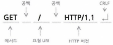
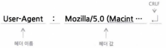
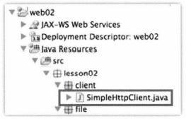
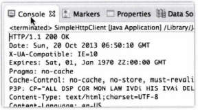
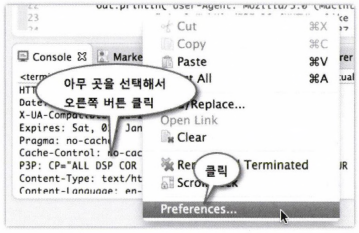
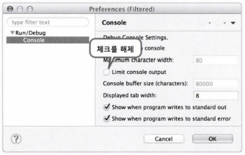
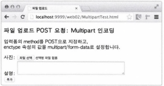
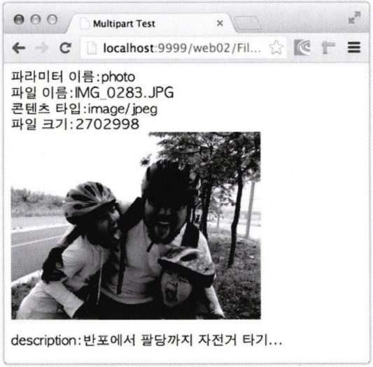
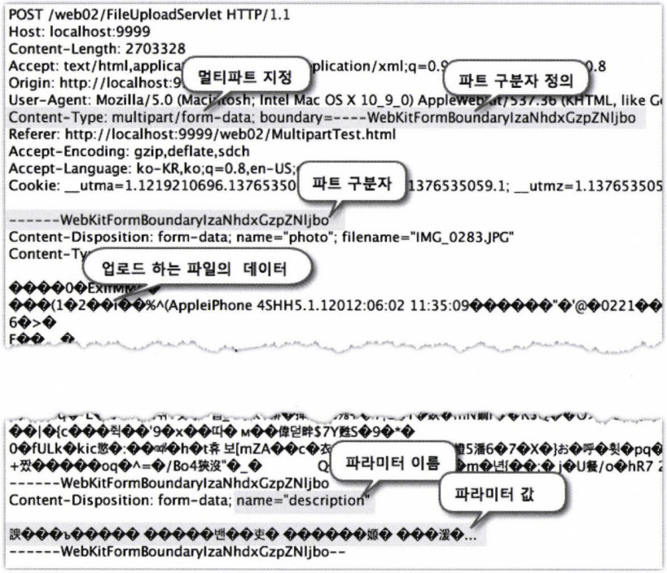
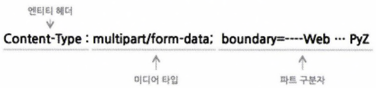

# 제2장 : 웹 프로그래밍 기초 다지기[↩](../../)

## contents📑<a id='contents'></a>

* 1_ HTTP 프로토콜의 이해 [👉](#1)
  * 1_1 HTTP 모니터링[✏](#1_1)
  * 1_2 HTTP 프록시 실행[✏](#1_2)
  * 1_3 HTTP 요청[✏](#1_3)
  * 1_4 HTTP 응답[✏](#1_4)
  * 1_5 HTTP 클라이언트만들기[✏](#1_5)
  * 1_6 콘솔창의 출력 크기를 늘리거나 제한을 없애기[✏](#1_6)
* 2_ GET 요청[👉](#2_)
  * 2_1 웹 애플리케이션 프로젝트 생성, 배치, 실행[✏](#2_1)
  * 2_2 GET 요청 1 - 웹 브라우저 주소창에 URL을 입력하는 경우[✏](#2_2)
  * 2_3 GET 요청 2 - 링크를 클릭하는 경우[✏](#2_3)
  * 2_4 GET 요청 3 - 입력 폼의 method 속성값이 get인 경우[✏](#2_4)
  * 2_5 GET 요청의 데이터 전달 형식[✏](#2_5)
  * 2_6 GET 요청의 쓰임새[✏](#2_6)
  * 2_7 문제점과 개선 방안[✏](#2_7)
* 3_ POST 요청
  * 3_1 POST 요청의 장점 - 입력값을 URLOII 노출하지 않는다.
  * 3_2 POST 요청의 HTTP 프로토콜 확인
  * 3_3 POST 요청의 단점 - 요청 결과를 공유할 수 없다.
  * 3_4 문제점과개선방안
* 4_ 파일 업로드✔[👉](#4)
  * 4_1 파일 업로드를 위한  태그 설정[✏](#4_1)
  * 4_2 멀티파트 방식의 POST 요청 프로토콜 분석[✏](#4_2)
* 2.5 정리[👉](#5)

## 1_ HTTP 프로토콜의 이해[📑](#contents)<a id='1'></a>

 웹 애플리케이션은 웹을 기반으로 구동되기 때문에 웹 프로그래밍을 하려면 웹 브라우저와 웹 서버 간의 통신 프로토콜을 이해하는 것이 필수입니다. 이 프로토콜을 HTTP(Hyper-Text Transfer Protocol)이라고 부릅니다. 이번 장 에서는 HTTP 문법에 따라 웹 브라우저가 웹 서버에게 서비스를 요청하고 웹 서버가 응답하는 방법을 살펴보겠습니다.

 * HTTP 프로토콜 : 웹 브라우저와 웹 서버 사이의 데이터 통신 규칙


> **그림2-1** 웹 브라우저와 웹 서버 간의 통신 프로토콜 HTTP

* HTTP 프로토콜은 단순히 HTML 페이지나 이미지 파일을 전송하는 차원을 넘어서 원격 컴퓨터 에 로딩되어 있는 함수나 객체의 메서드를 호출할 때도 사용됨.

* 클라이언트와 서버 사이에 서비스를 요청하고 응답을 하는 방식

  * SOAP(Simple Object Access Protocol)
  * RESTful(REpresentational State Transfer) : AWS 클라우드, KT의 클라우드에서 제공하는 API

* HTTP 프로토콜 응용 기술

  * WebDAV(World Wide Web Distributed Authoring and Versioning)

    : 웹 상에서 여러 사람이 문서나 파일을 더 쉽게 편집하고 다룰 수 있게 협업을 도와주는 기술

  * CalDAV

    : 캘린더 데이터를 보다 쉽게 편집하고 공유할 수 있도록 WebDAV를 확장한 기술


### 1_1 HTTP 모니터링[📑](#contents)<a id='1_1'></a>

HTTP 프록시 프로그램 : 웹 브라우저와 웹 서버 사이에 주고받는 데이터들의 이동 경로


> **그림2-2** 프록시 프로그램의 요청 • 응답 데이터 가로채기
>
> 1. 웹 브라우저가 웹 서버에게 요청을 하면 HTTP 프록시가 그 요청을 대신 받아서 서버에 전달합니다. 
> 2. 서버에서 응답이 오면 HTTP 프록시가 그 응답을 대신 받아서 웹 브라우저에게 전달합니다. 

 이렇게 웹 브라우저와 웹 서버의 중간에서 요청이나 응답 내용을 중계해 주기 때문에 둘 사이에 서 주고받는 내용이 무엇인지 엿볼 수 있습니다.

>  **프록시 서버(Proxy Server)**는 클라이언트와 서버 사이에서 통신을 중계해 주는 컴퓨터 나 프로그램을 말합니다. 
>
> 1. **프록시 서버의 주된 용도 중 하나** : 빠른 전송
>
>     빠른 전송을 위하여 서버의 응답 결과를 캐시에 저장해 두는 것입니다. 예를 들어 클라이언트가 요청한 것이 캐시(cache; 외부 서버로부터 받은 데이터를 임시 보관해두는 장소)에 있을 경우 외부 서버에 요청을 전달 하지 않고 즉시 캐시에 저장된 내용을 전달하기 때문에 클라이언트는 빠른 응답 결과를 받게 됩니다. 
>
> 2. **프록시 서버를 두는 두 번째 이유** : 보안
>
>     첨단 기술을 다루는 회사의 경우 내부 사용자의 기밀 유출에 민감할 수밖에 없습 니다. 이런 경우 프록시 서버를 이용하면 외부 로 전달되는 데이터를 검사하여 특정 단어가 포 함된 자료의 송 • 수신을 차단하거나 보안 팀에 경고 메시지를 보낼 수 있습니다.


### 1_2 HTTP 프록시 실행[📑](#contents)<a id='1_2'></a>

* HTTP모니터링 프로그램 : Charles, Fiddler

#### HTTP 모니터링 프로그램 실습 : Charles

#### 1. ‘Charles' 프로그램 실행
: 설치 후 윈도우 시작메뉴에서 [모든 프로그램] - [Charles] - [Charles] 메뉴를 클릭


> **그림2-3**  Charles 실행

#### 2.  '다음(www.daum.net)' 사이트 실행

#### 3.  Charles 프로그램의 화면을 통해 웹 브라우저가 요청한 내용 출력


> **그림2-5**  www.daum.net 사이트의 요청 목록
>
> HTTP 프로토콜의 상세 내용을 확인하려면 다음 안내에 따라 확인합니다.
>
> 1. [Structure] 탭을 클릭합니다. 사이트 별로 요청 내용을 묶어서 출력됩니다.
> 2. ’다음' 사이트의 메인 화면에 대한 요청 - 응답 프로토콜을 확인하기 위해 요청 목록에서 [default] 항목을 클릭합니다.

* 여기서 window 환경에서는 [default] 부분이 나오니 않는다...[unknown]인가..?

### 1_3 HTTP 요청[📑](#contents)<a id='1_3'></a>

#### 4. 웹 브라우저가 웹 서버에게 요청하는 형식 파악


> **그림 2-6** www.daum.net의 HTTP 요청 정보
>
> 다음 절차에 따라 진행하세요.
>
> 1. 화면 오른쪽에 [Request] 탭을 클릭합니다. 
> 2. 출력된 창 아래의 [Raw] 탭을 클릭합니다. 가공하지 않은 원래 요청 데이터를 출력할 것입니다. 
> 3. 앞의 그림은 HTTP 요청 내용을 출력한 결과 화면입니다.

#### <u>서버에게 보낸 HTTP 요청 내용</u><a id='req'></a>

: www.daum.net의 HTTP 요청 정보의 일부

---
* 01 GET / HTTP/1.1 [👉](#req-line)
* 02 Host: www.daum.net
* 03 Cache-Control: max-age=0
* 04 Accept:text/html,application/xhtml+xml,application/xml;q=0.9,image/webp,*/*;q=0.8
* 05 User-Agent: Mozilla/5.0 (Macintosh; Intel Mac OS X 10_9_0) AppleWebKit/537.36(KHTML, like Gecko) Chrome/30.0.1599.101 Safari/537.36[👉](#req-header)
* 06 Accept-Encoding: gzip, deflate, sdch
* 07 Accept-Language: ko-KR,ko;q=0.8,en-US;q=0.6,en;q=0.4
* 08[👉](#req-data)

---


>  **개행 문자**란 문자열 한 줄이 끝나고 새로 운 줄을 시작한다는 것을 의미하는 문자입니다. MS 윈도우에서는 CR(Carriage Return) 코드와 LF(Linefeed) 코드를 함께 사용하여 개행을 표시합니다. 리눅스나 맥 OSX 등 유닉스 계열에서는 LF 코드만 사용하여 개행을 표시합니다. 
>
>  따라서 윈도우에서 작성한 텍스트를 유닉스에서 읽을 때 라인 끝에 이상에 글자가 출력된다거나, 유닉스에서 작성한 텍스트를 윈도우에서 읽을 때 라인이 끝나지 않고 이어서 계속 출력되는 현상이 발생합니다.

#### <u>요청 라인(Reqeust-Line)</u>[🔺](#req)<a id='req-line'></a>

 요청메시지의 첫 라인은 메서드와 요청하는 자원, 프로토콜 버전으로 구성됩니다.



> **그림 2-7** HTTP 요청의 Request-Line 형식

| 요청라인  | 설명                                                         |
| --------- | ------------------------------------------------------------ |
| 매서드    | 요청하는 자원에 대해 웹 서버에게 내리는 명령입니다.<br />`GET`, `POST`, `HEAD`, `PUT`, `DELETE`, `TRACE`, `CONNECT`, `OPTIONS` 등 |
| 요청 URI  | 요청하는 자원의 식별자<br />즉, HTML이나 이미지, 동영상, 애플리케이션 등이 있는 가상의 경로. <br />웹 서버는 이 식별자를 이용하여 해당 자원을 찾음 |
| HTTP 버전 | 요청 정보가 어떤 버전에 맞추어 작성했는지 웹 서버에게 알려주기 위하여 쓰임. |

#### <u>요청 헤더[🔺](#req)</u><a id='req-header'></a>

: HTTP 요청 내용 중에 2〜7번 라인은 서버가 요청을 처리할 때 참고하라고 클라이언트에서 웹 서버에게 알려주는 정보임.



> **그림 2-8** HTTP 요청의 헤더 정보 형식

| 헤더의 종류                                                  | 설명                                    |
| ------------------------------------------------------------ | --------------------------------------- |
| 일반 헤더<br />(General-header)                              | 요청이나 응답 모두에 적용 가능          |
| 요청 헤더 또는 응답 헤더<br />(Request-header/ Response-header) | 요청 또는 응답 둘 중 하나에만 적용 가능 |
| 엔티티 헤더<br />(Entity-header)                             | 보내거나 받는 본문 데이터를 설명        |

| 헤더 유형                          | 헤더명                                                       |
| ---------------------------------- | ------------------------------------------------------------ |
| 일반헤더 (General Header Fields)   | Cache-Control<br />Connection<br />Date <br />Pragma<br />Trailer <br />Transfer_Encoding<br />Upgrade<br />Via<br />Warning |
| 요청 헤더  (Request Header Fields) | Accept<br />Accept-Charset<br />Accept-Encoding<br />Accept-Language<br />Authorization<br />Expect <br />From <br />Host <br />If-Match <br />If-Modified-Since <br />If-None-Match <br />If-Range <br />If-Unmodified-Since <br />Max-Forwards <br />Proxy-Authorization <br />Range <br />Referer <br />TE <br />User-Agent |
| 응답 헤더 (Response Header Fields) | Accept-Ranges <br />Age <br />ETag <br />Location <br />Proxy-Authenticate <br />Retry-After <br />Server <br />Vary <br />WWW-Authenticate |
| 본문 헤더 (Entity Header Fields)   | Allow <br />Content-Encoding <br />Content-Language <br />Content-Location <br />Content-MD5 <br />Content-Range <br />Content-Type <br />Expires <br />Last-Modified <br />기타 확장 헤더 |

* 요청 헤더 중 `User-Agent` : 클라이언트의 정보를 서버에게 알려 주는 헤더. 웹 서버는 이 헤더를 분석하여 요청자의 OS와 브라우저를 구분함.

#### <u>공백 라인과 요청 데이터(message-body)</u>[🔺](#req)<a id='req-data'></a>

* HTTP 요청 내용 중에서 마지막 8번 라인은 요청 헤더의 끝을 표시하는 공백 라인
  * 웹 브라우저의 주소창에 URL을 입력하거나 웹 페이지에서 링크를 클릭하는 경우에는 GET 요청을 서버에 보냄
  * GET 요청은 공백 라인으로 종결
  * 서버에 보낼 데이터가 있다 면 URL 주소에 붙여 보냄
  * 그에 비해 로그인이나 게시글을 등록하는 경우는 보통 POST 요청을 보냄
  * POST 요청은 공백 라인 다음에 서버에 보낼 데이터(message—body)가 옴


### 1_4 HTTP 응답[📑](#contents)<a id='1_4'></a>

#### 5. 'Charles' 프로그램의 오른쪽 화면에서 'Response' 탭을 선택

#### 6. 출력 창 아래의 [Raw]를 클릭하여 웹 서버가 보낸 응답 내용 출력

#### <u>서버로부터 받은 HTTP 응답 내용</u><a id='res'></a>

---

* 01 HTTP/1.1 200 0K [👉](#res-status)
* 02 Date: Fri, 18 Oct 2013 11:36:25 GMT [👉](#res-header)
* 03 X-UA-Compatible: IE=10 
* 04 Expi res : Sat, 01, Jan 1970 22:00:00 GMT 
* 05 Pragma: no-cache
* 06 Cache-Control: no-cache , no-store, must-revalidate 
* 07 P3P: CP="ALL DSP COR MON LAW IVDi HIS IVAi DELi SAMi OUR LEG PHY UNI ONL DEM STA INT NAV PUR FIN OTC GOV" 
* 08 Content-Type : text/html;charset=UTF-8 
* 09 Content-Lang니age: ko-KR 
* 10 Vary : Accept-Encodi ng 
* 11 Content-Encoding: gzip 
* 12 X-UA-Devi ce-Type : pc 
* 13 Content-Length : 34770 14 Connection: close 
* 15 [👉](#res-data)
* 16 <!DOCTYPE html>
* 17  <html lang='ko'>
* 18  <head>
* 19 ...

---

#### <u>상태 라인(Status—Line)</u>[🔺](#res)<a id='res-status'></a>

* 프로토콜 버전, 상태 코드, 설명으로 구성


> **그림 2-9** HTTP 응답의 Status-Line 형식

| 상태코드 | 상태설명                                                     |
| -------- | ------------------------------------------------------------ |
| 200      | 요청이 성공적으로 처리되었다.                                |
| 301      | 요청한 자원이 이동되었다. <br />헤더 정보에 이동 위치를 알려줄 테니 다시 요청하라. |
| 304      | 클라이언트가 임시 보관한 응답결과와 다르지 않다              |
| 400      | 잘못된 요청이다.                                             |
| 404      | 요청한 자원을 못 찾았다. 서버 내부에서 오류가 발생하였다.    |
| 500      | 요청한 자원을 못 찾았다. 서버 내부에서 오류가 발생하였다.    |

#### <u>응답 헤더</u>[🔺](#res)<a id='res-header'></a>

* HTTP 응답 내용 중에서 2 〜 14번 라인은 응답 데이터를 처리할 때 참고하라고 웹 브라우저에게 알려 주는 정보
* 특히, Content-Type 헤더는 서버가 웹 브라우저에게 보내는 데이터의 형식을 나타냄
* 웹 브라우저는 이 헤더의 값을 보고 데이터를 출력할지, 다운로드 창을 띄울지 아니면 외부 프로그램을 실행할지 결정
* Content-Length는 웹 브라우저에게 보내는 데이터(message-body)의 크기(Byte)

#### <u>공백 라인과 응답 데이터(message-body)</u>[🔺](#res)<a id='res-data'></a>

* HTTP 응답 내용 중에서 15번 라인은 메시지 헤더와 응답 데이터를 구분하기 위한 공백 라인
* 16번 라인부터 응답 데이터
* 이렇게 웹 브라우저와 웹 서버는 HTTP 형식에 맞추어 데이터를 보내고 받음. 

### 1_5 HTTP 클라이언트만들기[📑](#contents)<a id='1_5'></a>

 클라이언트와 서버가 주고받는 데이터 형식만 안다면 누구나 클라이언트나 서버를 개발할 수 있습니다. 이제 HTTP 프로토콜을 배웠으니 간단히 HTTP 클라이언트를 만들어 보겠습니다.

#### 7. web02 프로젝트의 자바 소스 패키지 'lesson02' 아래에 'client' 패키지를 생성 `client` 패키지 아래에 `SimpleHttpClient` 클래스를 생성



> **그림 2-10** SimpleHttpClientjava 소스 파일

#### 8. SimpleHttpClient 클래스를 작성

```java
package lesson02.client;

import java.io.BufferedReader;
import java.io.InputStreamReader;
import java.io.PrintStream;
import java.net.Socket;

public class SimpleHttpClient {

	public static void main(String[] args) throws Exception {
        //1. 소켓 및 입출력 스트림 준비
		Socket socket = new Socket("www.hani.co.kr", 80);
		BufferedReader in = new BufferedReader(
				new InputStreamReader(socket.getInputStream()));
		PrintStream out = new PrintStream(
				socket.getOutputStream());

		//2. 요청라인
		out.println("GET / HTTP/1.1");

		//3. 헤더정보
		out.println("Host: www.hani.co.kr");
		out.println("User-Agent: Mozilla/5.0 (Macintosh; Intel Mac OS X 10_9_0)"
				+ " AppleWebKit/537.36 (KHTML, like Gecko)"
				+ " Chrome/30.0.1599.101 Safari/537.36");
		//4. 공백라인
		out.println();
        
		//5. 응답 내용 출력
		String line = null;
		while((line = in.readLine()) != null) {
			System.out.println(line);
		}

		in.close();
		out.close();
		socket.close();
	}

}
```

> SimpleHttpClient.java

1. 접속할 웹 서버는 ’다음’ 사이트입니다. 웹 서버의 기본 포트번호는 80이기 때문에 접속할 서버 의 포트번호를 80으로 지정합니다. 그리고 소켓으로 입·출력을 하기 위한 객체를 준비합니다.
2. 먼저 서버에게 수행할 작업을 알려주는 요청라인을 보냅니다. 요청 형식은 GET, 원하는 자 원은 웹 서버 루트 폴더에 있는 기본 문서(/), 사용할 프로토콜은 HTTP, 버전은 1.1입니다. 
3. 웹 서버에 부가 정보를 보냅니다. 접속하려는 웹 서버의 주소는 www.daum.net, 요청자의 정 보는 크롬 브라우저라고 설정합니다. ’다음' 웹 서버는 `Host`, `User-Agent` 이렇게 두 가지 헤더 만 보내도 정상적으로 응답해 주네요. 
4. 요청의 끝을 표시하기 위해 공백 라인을 보냅니다. 
5. 서버로부터 받은 데이터를 라인 단위로 읽어서 출력합니다

#### 9. ’다음’ 웹 서버로부터 받은 데이터가 ’Console’ 뷰로 출력됨.



> **그림2-12** www.daum.net의 응답 결과

#### 10. 다음 그림과 같이 ’다음’ 웹 서버로부터 받은 데이터가 ’Console’ 뷰로 출력될 것입니다.

* 첫 라인은 응답 상태정보
* 두 번째 라인부터 공백 라 인까지는 헤더들
* 공백 라인 다음에는 HTML로 된 본문 데이터

### 1_6 콘솔창의 출력 크기를 늘리거나 제한을 없애기[📑](#contents)<a id='1_6'></a>

 만약 콘솔 뷰(console View)의 출력 결과가 짤린다면, 다음의 절차에 따라 콘솔 뷰의 출력 크기를 늘리거나 제한을 없애면 됨

#### 11. 콘솔 뷰의 컨텍스트 메뉴를 띄움



> **그림2-13** 콘솔의 설정창 열기

#### 12. 콘솔 뷰의 속성 설정창에서 다음 그림과 같이 출력 크기를 제한하는 항목(Limit console output)의 체크 상자를 해제



> **그림2-14** 콘솔 설정창에서 출력 라인 수의 제한 해제

>  널리 알려진 프로토콜 몇 가지를 간단히 살펴보도록 하겠습니다. 다음에 언급하는 프로토콜은 개발 세계에 몸담고 있는 동안 자주 듣게 될 것입니다.
>
> | 프로토콜                                         | 내용                                                         |
> | ------------------------------------------------ | ------------------------------------------------------------ |
> | FTP(File Transfer Protocol)                      | 클라이언트와 서버 간에 파일을 주고받기 위해 만든 통신 규약입니다. |
> | Telnet 프로토콜                                  | 인터넷이나 LAN(Local Area Network) 상에서 문자 기반 으로 원격의 컴퓨터를 제어하기 위해 만든 통신 규약입니 다. 요즘은 보안 때문에 SSH(Secure Shell) 프로토콜 기 반 원격 접속 프로그램을 주로 사용합니다. |
> | XMPP(Extensible Messaging and Presence Protocol) | 인스턴스 메시지 및 사용자의 접속 상태 정보를 교환할 목 적으로 만든 통신 규약이며 Goo임e Talk가 이 프로토콜을 i 기반으로 통신합니 다. |
> | SMTP(Simple Mail Transfer Protocol)              | 인터넷 상에서 메일을 보내기 위한 통신 규약입니다. POP3(Post Office Protocol version 3)는 이메일을 가져 오는 데 사용하는 통신 규약이며 POP3는 이메일을 가져온 후 서버의 메일을 삭제합니다. |
> | IMAPdnternet Message Access Protocol)            | POP3와 달리 이메일을 가져온 뒤에 서버의 메일으르 지우 지 않으며 요즘처럼 여러 대의 장비에서 이메일을 조회하는 경우에 적합합니다. 단, POP3에 비해 통신 트래픽이 높은 것이 단점입니다. |
> | LDAP(Lightweight Directory Access Protocol)      | 디렉터리 서비스에 등록된 자원들을 찾는 통신 규약입니다.      |
> | IRCdnternet Relay Chat)                          | 실시간 채팅을 위해 만든 통신 규약입니다.                     |

## 2_ GET 요청[📑](#contents)<a id='2'></a>
### 2_1 웹 애플리케이션 프로젝트 생성, 배치, 실행[📑](#contents)<a id='2_1'></a>


### 2_2 GET 요청 1 - 웹 브라우저 주소창에 URL을 입력하는 경우[📑](#contents)<a id='2_2'></a>


### 2_3 GET 요청 2 - 링크를 클릭하는 경우[📑](#contents)<a id='2_3'></a>


### 2_4 GET 요청 3 - 입력 폼의 method 속성값이 get인 경우[📑](#contents)<a id='2_4'></a>


### 2_5 GET 요청의 데이터 전달 형식[📑](#contents)<a id='2_5'></a>


### 2_6 GET 요청의 쓰임새[📑](#contents)<a id='2_6'></a>


### 2_7 문제점과 개선 방안[📑](#contents)<a id='2_7'></a>

## 4_ 파일 업로드[📑](#contents)<a id='4'></a>

 이번 절에서는 웹 서버에 바이너리 데이터를 보내도록 고안된 멀티파트 인코딩 방법을 확인해 보 겠습니다. 또한, 이를 위해 HTML의  태그를 어떻게 설정하는지 알아보겠습니다.

### 4_1 파일 업로드를 위한 `<form>`태그 설정[📑](#contents)<a id='4_1'></a>

#### 30. 웹 브라우저 주소창에 'http://localhost:9999/web02/MultipartTest.html'을 입력



> **그림2-32** 파일 업로드 입력 폼

 MultipartTest.html의 소스를 살펴보면, 파일을 업로드하는 입력 폼을 만들고자〈form〉태그의 enctype 속성을 'multipart/form-data'로 지정하였습니다. enctype 속성의 기본값은 'application/x-www-form-urlencoded'입니다. 파일을 입력하는 항목은〈input〉태그의 type 값을 ’file'로 지정합니다.

```html
<form action="FileUploadServlet" method="post"
      enctype="multi part/form-data">
사진: <input type="file" name="photo"><br>
설명: <textarea name="description" cols="50" rows="3"></textarea><br>
<input type="submit" value="추가"><br>
</form>
```

> **예제** web02/WebContent/MultipartTest.htmI의 일부분

#### 31. 입력 폼에서〈파일 선택〉버튼을 클릭하여 적당한 이미지 파일을 찾아 선택하고, 설명을 입력한 후〈추가〉버튼을 클릭합니다. 다음은 실행 결과입니다.



> **그림2-33** 파일 업로드 결과화면


### 4_2 멀티파트 방식의 POST 요청 프로토콜 분석[📑](#contents)<a id='4_2'></a>

#### 32. ‘Charles' 프로그램에서 요청 정보를 확인해 보면 다음과 같습니다.



> **그림 2-34** 파일 업로드의 HTTP 요청 정보

#### <u>일반 전송 방식의 Content-Type 헤더와 데이터 형식</u>

 POST 요청에서 일반 전송과 멀티파트 전송의 가장 큰 차이점은 Content-Type 헤더와 메시지 본문의 형식입니다. 다음은 이전 장에서 실습한 일반 전송 방식의 Content-Type 헤더입니다.

```
Content-Type: application/x-www-form-urlencoded
```

> 일반 전송 방식의 Content-Type 헤더

#### <u>멀티 파트 전송 방식의 Content-Type 헤더</u>

멀티파트 전송 방식에서 Content-Type 헤더는 다음 그림과 같이 데이터의 미디어 형식과 파트 구분자를 정의합니다.



> **그림2-35** 멀티파트 전송 방식의 Content—Type 헤더

#### <u>멀티 파트 전송의 데이터 형식</u>

 GET이나 POST 요청에서 웹 서버에 보내는 문자 매개변수들은 를 사용하여 구분하였습니다. 그러나 바이너리 데이터를 함께 전송할 때는 '&'를 사용하여 매개변수들을 구분할 수 없습니다. 바이너리 데이터에 문자에 해당하는 코드 값이 포함될 경우 웹 서버에서 매개변수 값을 분리 할 때 문제가 발생할 수 있기 때문입니다. 

 이런 이유로 보내는 데이터에 파일을 첨부할 때는 매개변수를 정확히 구분하기 위해 특별한 구 분자를 사용합니다. Content-Type 헤더의 boundary 값이 바로 각각의 매개변수 값을 분리할 때 사용할 구분자를 정의한 것입니다. 이 구분자는 웹 브라우저에서 임의로 생성합니다. 웹 서버는 이 구분자를 사용하여 메시지 본문에서 매개변수를 분리하고 해석합니다.

```
------WebKitFormBoundaryIzaNhdxGzpZNljbo
Content-Disposition: form-data; name="photo"; filename="IMG_0283.JPG"
Content-Type: image/jpeg

...
---------WebKi tFormBoundarylzaNhdxGzpZNlj bo
Content-Disposition: form-data; name="description"

...
--------- WebKitFormBoundarylzaNhdxGzpZNljbo-
```

> 멀티 파트 전송 프로토콜에서 메시지 본문의 일부분

 파트 구분자 다음 라인을 보면 매개변수 정보가 옵니다. 만약 매개변수의 데이터가 파일인 경우 첨부 파일의 이름과 콘텐츠 유형 정보가 추가로 옵니다. 공백 라인 이후부터 다음 파트 구분자를 만날 때까지 첨부 파일의 데이터가 옵니다.


> **그림2-36** 멀티 파트 데이터의 매개변수 정보

 이렇게 멀티 파트 형식으로 데이터를 보낼 때는 웹 서버에서도 그에 맞추어 데이터를 분리하고 해 석해야 합니다. 자바 웹 프로그래밍에서도 일반적인 형식과 멀티 파트 형식을 구분하여 데이터를 처리합니다. 이에 대한 자세한 사항은 이후에 배우게 될 것입니다.

## 5_ 정리[📑](#contents)<a id='5'></a>

 이번 장에서는 'Charles' 프로그램을 사용하여 웹 브라우저와 웹 서버 사이의 대화 내용을 살펴보 았습니다. 이를 통해 HTTP 프로토콜의 요청 형식과 응답 형식을 직접 확인하였습니다. 

 HTTP 프로토콜에서 가장 많이 사용되는 요청 형식은 GET과 POST 입니다. GET 요청은 브라 우저의 주소창에 직접 URL을 입력하거나 사용자가 링크를 클릭하는 경우에 발생하고, 때론 구 글 검색처럼 입력 폼을 통해서도 GET 요청을 수행할 수 있습니다. 

 그러나 사용자가 입력한 데이터가 주소창에 그대로 노출되기 때문에 로그인이나 결제정보를 서 버에 보낼 때는 GET 형식으로 보내서는 안 됩니다. 대신 POST 형식으로 요청을 보내야 합니다. POST 형식은 웹 서버에 데이터를 보낼 때 메시지 본문 부분에 붙여서 보내기 때문에 주소창에 노출될 위험이 없습니다. 또한, 보내는 데이터의 크기에 제한이 없습니다. 

 웹 서버에 파일을 첨부하여 보낼 경우에는 멀티 파트 인코딩이라는 아주 특별한 형식을 사용해야 합니다. 그래야만 다른 데이터와 구분할 수 있습니다. 파일 업로드에 대한 HTTP 요청 정보를 살 펴보면 매개변수의 값들이 특별한 구분자에 의해 개별적으로 분리되어 있음을 알 수 있습니다. 

 이번 장을 통해 HTTP 프로토콜에 대해 막연하게 생각되었던 것들이 어느 정도 정리되었으리라 봅니다. 웹 개발자라면 이번 장의 내용을 반드시 알고 있어야 합니다. 용어나 개념이 정리되어 있 지 않으면 앞으로 진행되는 과정에 어려움이 있을 수 있으니 확실히 이해하고 넘어가기 바랍니 다. 이제 본격적으로 웹 프로그래밍의 문을 두드려 보도록 하겠습니다. 자, 다음 장으로 갑시다!

### 
