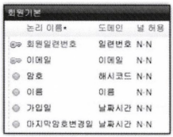

# 제4장 : 서블릿과 JDBC[↩](../../)

## contents📑<a id='contents'></a>

* 1_ 데이터베이스에서 데이터 가져오기[👉](#1)
    * 1_1 회원목록조회 구현[✏](#1_1)
    * 1_2 서블릿 배치 정보 설정[✏](#1_2) 
    * 1_3 ’회원 목록 조회' 서블릿 테스트[✏](#1_3) 
* 2_ HttpServlet으로 GET 요청 다루기 178 
    * 2_1 회원 목록 화면에 ’신규 회원’링크 추가 178 
* 3_ HttpServlet으로 POST 요청 다루기 186 
    * 3_1 doPost() 오버라이딩 187 
    * 3_2 회원 등록테스트 191 
* 4_ 요청 매개변수의 한글 깨짐 처리 194 
    * 4_1 한글깨짐현상 194 
    * 4_2 한글입력값이깨진이유 195 
    * 4_3 한글깨짐해결책 196 
    * 4_4 GET 요청 매개변수의한글 깨짐 해결책 197 12 
* 5_ 리프래시 200 
    * 5_1 자동으로 회원 목록을 출력하기 200 
* 6_ 리다이렉트 204 
    * 6_1 리다이렉트실습하기 204 
* 7_ 서블릿 초기화 매개변수 207 
    * 7_1 회원 정보 조회와 변경 208 
    * 7_2 회원 목록 페이지에 상세 정보 링크 추가 209 
    * 7_3 DD파일에 서블릿 초기화 매개변수 설정 210 
    * 7_4 회원 상세 정보 출력하는 서블릿 작성 212 
    * 7_5 회원 정보변경하기 219 
    * 7_6 애노테이션으로 서블릿 초기화 매개변수 설정 221 
* 8_ 컨텍스트 초기화 매개변수 224 
    * 8_1 컨텍스트 초기화 매개변수의 선언 224 
    * 8_2 컨텍스트 초기화 매개변수의 사용 225 
* 9_ 필터 사용하기 229 
    * 9_1 필터 230 
    * 9_2 필터 만들기 231 
    * 9_3 필터의구동 234 
    * 9_4 필터의 배치 235 
* 10_ 정리

## 1_ 데이터베이스에서 데이터 가져오기[📑](#contents)<a id='1'></a>

 서블릿이 하는 주된 일은 클라이언트가 요청한 데이터를 다루는 일입니다. 데이터를 가져오거나 입력, 변경, 삭제 등을 처리하려면 데이터베이스의 도움을 받아야 합니다. 데이터베이스는 개발자들이 쉽게 데이터를 저장하고 꺼낼 수 있도록 도와주는 프로그램입니다. 데이터베이스가 없다면, 개발자들이 직접 파일 입출력 API를 사용하여 데이터를 다뤄야 합니다. 

데이터베이스를 사용하려면 두 가지가 필요합니다. 

* 첫 번째는 데이터베이스에 요청을 전달하고 결과를 받을 때 사용할 도구입니다. 자바에서는 데이터베이스와의 통신을 위해 JDBC 기술을 제공합니다. 
* 두 번째는 데이터베이스에 명령을 내릴 때 사용할 언어입니다. SQL(Structured Query Language)은 데이터를 정의하고 조작할 때 사용하는 데이터베이스를 위한 표준 명령어입니다. 

 개발자는 SQL로 데이터베이스가 할 일을 작성하고, JDBC를 사용하여 데이터베이스로 SQL을 보내고 결과를 받습니다. 이번 절에서는 JDBC를 사용하여 데이터베이스와 연동하는 방법을 배워 보겠습니다.


> **그림 4-1** 서블릿과 JDBC

### 1_1 회원 목록 조회 구현[📑](#contents)<a id='1_1'></a>

 데이터베이스에 저장된 데이터를 가져와서 웹 브라우저로 출력하는 서블릿, 바로 '회원 목록 조회'를 구현해보겠습니다. 이를 위해 JDBC를 사용하여 데이터베이스에 접속하는 방법과 SQL문을 통해 데이터를 다루는 방법을 배울 것입니다.

#### 회원 테이블 생성

 회원 데이터를 입력하고 조회할 테이블을 생성하겠습니다. 다음은 회원 기본 정보를 표현한 논 리 모델입니다.



> **그림4-2** 회원 기본 정보의 논리모델

 회원 기본 정보 테이블에서 이메일을 기본 키(Primary Key)로 지정하지 않은 이유는 나중에 변경 할 수 있게 하기 위해서 입니다. 기본 키 칼럼의 값은 한 번 설정되면 변경할 수 없기 때문에 '일련번호' 칼럼을 기본 키로 사용합니다. 다만, 이메일 값은 중복되지 않도록 유니크(Unique)로 설정합니다. '마지막암호변경일' 칼럼은 암호를 변경할 때 날짜를 저장해 두었다가 일정 시간이 지나면 다시 암호를 변경하도록 요구하기 위한 칼럼입니다.

#### 1. 회원 기본 정보 테이블을 생성합니다. MySQL Workbench의 Query 편집기에서 다음 SQL 문을실행합니다;

```mysql
CREATE TABLE MEMBERS (
MNO INTEGER NOT NULL COMMENT			'회원일련번호' ,
EMAIL VARCHAR(40) NOT NULL COMMENT		'이메일' ,
PWD VARCHAR(100) NOT NULL COMMENT		'암호',
MNAME VARCHAR(50) NOT NULL COMMENT		'이름',
CRE_DATE DATETIME NOT NULL COMMENT		'가입일',
MOD_DATE DATETIME NOT NULL COMMENT		'마지막암호변경일'
)
COMMENT '회원기본정보’;
```


### 1_2 서블릿 배치 정보 설정[📑](#contents)<a id='1_2'></a>

### 1_3 '회원 목록 조회' 서블릿 테스트[📑](#contents)<a id='1_3'></a>


